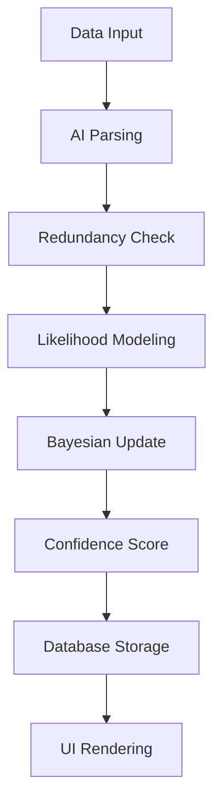

# InFact: Building Trust in Science through Collaborative Evaluation

[](https://github.com/rohilrao/InFactGAIA)
[](LICENSE)
[]([https://streamlit.io](https://infact-gaia-demo.streamlit.app/))
[](https://python.org)

**A Gaia Lab Project**

[](https://gaia-lab.de)
[](https://www.lesswrong.com/posts/TK92QZ8L6cXvvhXbF/gaia-network-an-illustrated-primer)
[](https://www.youtube.com/watch?v=47r5P6xtjms)


---

> *"What we should do is create an institution that collects and evaluates scientific evidence and gives out confidence values based on evidence."*
> — [Sabine Hossenfelder](https://www.youtube.com/watch?v=zucXnn64qtk&t=314s)

InFact is our attempt to realize this vision: a **decentralized model-based inference engine** that evaluates scientific claims and provides clear confidence measures based on available evidence. By combining AI with rigorous Bayesian statistics, InFact enables scientists and the public to collaboratively assess the reliability of scientific findings.

## 🚀 Quick Start

```bash
# Clone the repository
git clone https://github.com/rohilrao/InFactGAIA.git
cd InFactGAIA

# Switch to the streamlit app branch
git checkout streamlit_app_v4

# Install dependencies
pip install -r requirements.txt

# Run the Streamlit demo
streamlit run app.py
```

> **Note**: InFact is currently available as a Streamlit demonstration application. The demo showcases the core Bayesian inference capabilities and AI-powered evidence analysis.

## 📋 Table of Contents

- [Overview](#-overview)
- [How It Works](#-how-it-works)
- [Technical Details](#-technical-details)
- [Installation](#-installation)
- [Usage](#-usage)
- [Contributing](#-contributing)
- [Roadmap](#-roadmap)
- [Related Projects](#-related-projects)

## 🔍 Overview

<details>
<summary><strong>Click to expand overview</strong></summary>

InFact addresses a critical challenge in modern science: **how do we systematically evaluate the reliability of scientific claims?** 

Traditional peer review, while valuable, has limitations:
- **Inconsistent standards** across journals and fields
- **Publication bias** toward positive results
- **Limited transparency** in the review process
- **Difficulty integrating** evidence across studies

InFact proposes a different approach:
- **Systematic evidence evaluation** using Bayesian statistics
- **AI-powered data analysis** that adapts to different study types
- **Complete transparency** with all analyses publicly available
- **Collaborative assessment** by the scientific community
- **Real-time confidence updates** as new evidence emerges

### Key Features
- 🤖 **AI-Powered Analysis**: Uses frontier LLMs (Claude 3.5 Sonnet) for data extraction and analysis
- 📊 **Bayesian Inference**: Rigorous statistical framework for evidence evaluation
- 🔍 **Complete Transparency**: All data, analyses, and confidence scores are publicly available
- 🌐 **Decentralized Network**: Part of the broader Gaia Network Protocol
- 📈 **Real-time Updates**: Confidence scores evolve as new evidence is incorporated

</details>

## 🛠 How It Works

<details>
<summary><strong>Click to expand detailed workflow</strong></summary>

InFact operates through a network of **specialized nodes**, each focused on a specific scientific question. Here's how the process works:

### 1. Node Structure
Each InFact node contains:
- **Hypothesis (H)**: A binary scientific statement (e.g., "Human-generated GHG emissions significantly increase global temperatures")
- **Inference Engine**: Combines AI and Bayesian statistics for evidence evaluation
- **Database**: Stores all data points, analyses, and confidence updates
- **User Interface**: Visualizes confidence evolution and provides explanations

### 2. Evidence Processing Pipeline



**Step-by-step process:**

1. **Data Collection**: Accepts various formats (PDF, HTML, CSV, PNG)
2. **AI Parsing**: LLM extracts key information and data points
3. **Redundancy Check**: Identifies and removes duplicate evidence
4. **Likelihood Modeling**: Generates custom analysis pipeline for the data
5. **Bayesian Update**: Calculates log-likelihood updates and posterior probabilities
6. **Confidence Score**: Updates overall confidence in the hypothesis
7. **Storage & Visualization**: Records all updates and renders user interface

### 3. Quality Assessment
The system evaluates:
- **Study design** (meta-analysis vs. observational)
- **Statistical power** and reported uncertainties
- **Source reliability** and potential biases
- **Methodological rigor**

</details>

## 🔬 Technical Details

<details>
<summary><strong>Click to expand mathematical foundations</strong></summary>

### Bayesian Inference Framework

InFact implements a rigorous Bayesian approach to evidence evaluation:

#### Core Mathematical Model

For a hypothesis **H** and data point **D_i**:

**Likelihood Function:**
- Positive log-likelihood: `l⁺ᵢ = log P(Dᵢ | H, D<ᵢ)`
- Negative log-likelihood: `l⁻ᵢ = log P(Dᵢ | ¬H, D<ᵢ)`

**Posterior Update:**
```
πᵢ = πᵢ₋₁ + l⁺ᵢ - l⁻ᵢ
```

Where:
- `πᵢ` = posterior log-odds ratio after observing data point i
- `π₀` = prior log-odds ratio (initial belief)

#### Confidence Intervals

Using Beta distribution hyperparameters:
- `α⁺ᵢ = α⁺ᵢ₋₁ + P(H | D₁...Dᵢ)`
- `α⁻ᵢ = α⁻ᵢ₋₁ + P(¬H | D₁...Dᵢ)`

The second-order distribution converges to a Delta function peaked at the true probability `p*`.

#### Data Storage Schema

Each node maintains a sequence of tuples:
```
{(Dᵢ, l⁺ᵢ, l⁻ᵢ, πᵢ)}ᵢ
```

### AI-Powered Likelihood Estimation

The key innovation is using LLMs to generate likelihood functions:

1. **Context Analysis**: LLM analyzes study methodology and data quality
2. **Uncertainty Quantification**: Estimates measurement and methodological uncertainties
3. **Likelihood Generation**: Produces custom likelihood function for the specific data
4. **Rationale Recording**: All LLM prompts and responses are stored for transparency

### Algorithm Implementation

```python
def process_evidence(data_file, hypothesis_node):
    # Parse data using LLM
    data_points = llm_parse(data_file)
    
    # Remove redundant data
    new_points = filter_redundancy(data_points, hypothesis_node.database)
    
    # Generate likelihood model
    likelihood_model = llm_generate_likelihood(new_points, hypothesis_node.context)
    
    # Compute updates
    for point in new_points:
        l_pos, l_neg = likelihood_model.evaluate(point)
        hypothesis_node.update_posterior(l_pos, l_neg)
        hypothesis_node.store_update(point, l_pos, l_neg)
    
    # Render results
    hypothesis_node.render_ui()
```

</details>

## 💻 Installation

<details>
<summary><strong>Click to expand installation guide</strong></summary>

### Prerequisites
- Python 3.8 or higher
- pip package manager
- Git

### Option 1: Streamlit Demo (Current Implementation)

```bash
# Clone the repository
git clone https://github.com/rohilrao/InFactGAIA.git
cd InFactGAIA

# Switch to the demo branch
git checkout streamlit_app_v4

# Create virtual environment (recommended)
python -m venv infact-env
source infact-env/bin/activate  # On Windows: infact-env\Scripts\activate

# Install dependencies
pip install -r requirements.txt

# Run the Streamlit app
streamlit run app.py
```

### Option 2: Development Installation

```bash
# Clone with development dependencies
git clone https://github.com/rohilrao/InFactGAIA.git
cd InFactGAIA
git checkout streamlit_app_v4

# Install in development mode
pip install -e .
pip install -r requirements.txt

# Run tests (if available)
pytest tests/ || echo "Tests may not be available in demo version"
```

### Configuration

1. **API Keys**: Copy `.env.example` to `.env` and add your API keys:
   ```bash
   cp .env.example .env
   # Edit .env with your API keys (Claude, etc.)
   ```

2. **Database Setup**: Initialize the local database:
   ```bash
   python scripts/init_db.py
   ```

### Troubleshooting

**Common Issues:**
- **Permission errors**: Try using `pip install --user`
- **Missing dependencies**: Update pip with `pip install --upgrade pip`
- **API key errors**: Ensure your `.env` file is properly configured

</details>

## 📖 Usage

<details>
<summary><strong>Click to expand usage examples</strong></summary>

### Streamlit Demo Usage

```bash
# Start the Streamlit application
streamlit run app.py

# Access the demo at http://localhost:8501
```

**Demo Features:**
- Interactive hypothesis testing interface
- Evidence upload and analysis
- Real-time Bayesian inference visualization
- Confidence score tracking
- Evidence history and rationale display

### Basic Workflow in the Demo

1. **Create Hypothesis**: Enter your scientific hypothesis in the interface
2. **Upload Evidence**: Add research papers, datasets, or other evidence files
3. **Review Analysis**: See AI-powered evidence extraction and likelihood estimation
4. **Track Confidence**: Watch confidence scores update in real-time
5. **Explore Results**: Examine detailed rationales and confidence evolution

### Example Demo Session

```python
# Note: This represents the workflow within the Streamlit interface
# 1. Enter hypothesis: "Regular exercise reduces cardiovascular disease risk"
# 2. Upload evidence files (PDFs, CSVs, etc.)
# 3. Review AI analysis and likelihood calculations
# 4. Observe confidence score updates
# 5. Export results or continue adding evidence
```

### Advanced Demo Features

```python
# Note: These features may be available in future versions
# Current demo focuses on core Bayesian inference workflow

# Within the Streamlit interface, you can:
# - Adjust prior beliefs
# - Compare multiple hypotheses
# - Export analysis results
# - View detailed mathematical computations
```

### Integration Examples

**Future API Integration:**
```python
# Planned features for full implementation
import infact
node = infact.load_node("climate_change_node")
node.interactive_analysis()  # Will launch interactive widget
```

**Automated Evidence Monitoring (Roadmap):**
```python
# Future capability
monitor = infact.EvidenceMonitor(
    keywords=["climate change", "greenhouse gas"],
    sources=["arxiv", "pubmed", "google_scholar"],
    node_id="climate_node"
)
monitor.start()  # Will automatically add new evidence
```

</details>

## 🤝 Contributing

<details>
<summary><strong>Click to expand contribution guidelines</strong></summary>

We welcome contributions from the scientific community! Here's how you can help:

### Ways to Contribute

1. **🐛 Bug Reports**: Found an issue? [Open a bug report](https://github.com/gaia-lab/infact/issues/new?template=bug_report.md)
2. **💡 Feature Requests**: Have an idea? [Suggest a feature](https://github.com/gaia-lab/infact/issues/new?template=feature_request.md)
3. **📚 Documentation**: Help improve our docs
4. **🔬 Scientific Validation**: Test InFact on your research domain
5. **💻 Code Contributions**: Submit pull requests

### Development Setup

```bash
# Fork and clone the repository
git clone https://github.com/YOUR_USERNAME/infact.git
cd infact

# Create development environment
python -m venv dev-env
source dev-env/bin/activate

# Install development dependencies
pip install -e ".[dev]"
pre-commit install

# Run tests
pytest tests/ --cov=infact
```

### Coding Standards

- **Code Style**: We use `black` for formatting and `flake8` for linting
- **Type Hints**: All public functions should include type hints
- **Documentation**: Use docstrings for all functions and classes
- **Testing**: Maintain >90% test coverage

### Pull Request Process

1. **Create Feature Branch**: `git checkout -b feature/amazing-feature`
2. **Make Changes**: Implement your feature or fix
3. **Add Tests**: Ensure your changes are tested
4. **Update Documentation**: Add/update relevant documentation
5. **Run Tests**: `pytest tests/` and `pre-commit run --all-files`
6. **Submit PR**: Create a pull request with a clear description

### Scientific Contributions

We especially welcome contributions from domain experts:

- **Likelihood Functions**: Contribute specialized likelihood functions for your field
- **Validation Studies**: Test InFact against known scientific controversies
- **Methodological Improvements**: Suggest improvements to our Bayesian framework
- **Case Studies**: Document interesting applications of InFact

### Code of Conduct

Please note that this project follows the [Contributor Covenant Code of Conduct](CODE_OF_CONDUCT.md). By participating, you agree to uphold this code.

### Recognition

Contributors will be acknowledged in:
- The project README
- Release notes
- Academic publications (where appropriate)

</details>

## 🌐 Related Projects

<details>
<summary><strong>Click to expand related work</strong></summary>

### Gaia Network Ecosystem
- **[Gaia Network Protocol](https://gaia-lab.de)**: The broader decentralized intelligence framework
- **[Gaia Blog](https://www.lesswrong.com/posts/TK92QZ8L6cXvvhXbF/gaia-network-an-illustrated-primer)**: Detailed technical explanations
- **[Video Explanation](https://www.youtube.com/watch?v=47r5P6xtjms)**: Visual introduction to the concepts

### Inspiration and Related Work
- **[Metaculus](https://metaculus.com)**: Prediction platform for scientific and technological progress
- **[Semantic Scholar](https://semanticscholar.org)**: AI-powered research tool
- **[OpenReview](https://openreview.net)**: Open peer review platform
- **[Cochrane](https://cochrane.org)**: Systematic reviews in healthcare

### Academic References
- Hossenfelder, S. (2023). "The Need for Institutional Scientific Evaluation"
- Pearl, J. (2018). "The Book of Why: The New Science of Cause and Effect"
- Gelman, A. (2020). "Bayesian Workflow"

</details>

---

## 📄 License

This project is licensed under the MIT License - see the [LICENSE](LICENSE) file for details.

## 🙏 Acknowledgments

- **Sabine Hossenfelder** for the original inspiration
- **The Gaia Lab Team** for ongoing development and support
- **The scientific community** for feedback and validation
- **Contributors** who help make InFact better

## 📞 Contact

- **Website**: [gaia-lab.de](https://gaia-lab.de)
- **Repository**: [github.com/rohilrao/InFactGAIA](https://github.com/rohilrao/InFactGAIA)
- **Issues**: [GitHub Issues](https://github.com/rohilrao/InFactGAIA/issues)
- **Discussions**: [GitHub Discussions](https://github.com/rohilrao/InFactGAIA/discussions)

---

<div align="center">
<strong>Building a more transparent and trustworthy scientific future, one evidence node at a time.</strong>
</div>
